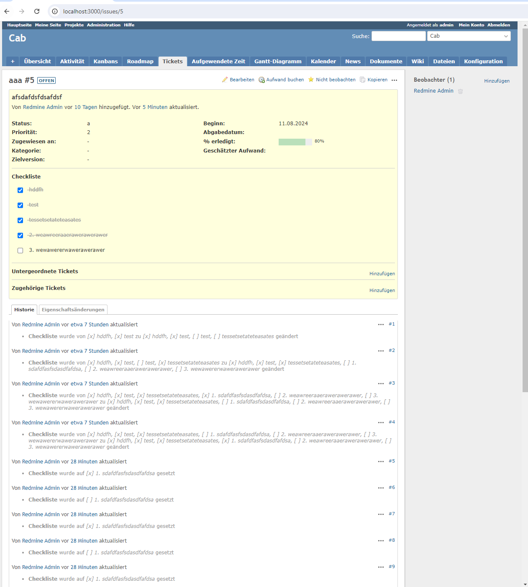

Hi there,

I was struggling with configuring this plugin and decided to go through all the configuration as I couldn't find a repo,
that provides a "ready" and configured solution for
**Redmine 5.1.x**.

1) It's actually a fork of https://github.com/Restream/redmine_issue_checklist
   but it doesn't work for me. No wonder, because it hasn't been updated for 7 years with maintainability F (Press F to pay respect)
2) Why did I decide to put Sortable.js and Prototype.js in one file? Because I don't care about performance and wanted it to work.

# How to install
1) `cd {REDMINE_ROOT}`
2) `git clone https://github.com/lievre95/redmine_issue_checklist plugins/redmine_issue_checklist`
3) `bundle exec rake redmine:plugins:migrate RAILS_ENV=production`
4) `RAILS_ENV=production bundle exec puma -C config/puma.rb`
5) Enjoy!

### **Was tested on Redmine 5.1.5**
### **Inside of wsl, please don't ask why =) # 

`uname -srm`
> Linux 4.4.0-19041-Microsoft x86_64 **

`wsl.exe --list --all`

> Windows-Subsystem für Linux-Distributionen:
Ubuntu (Standard)

`wsl -l -v`
NAME        STATE           VERSION
* Ubuntu    Running         1

# Details

`ruby -v`

> ruby 3.1.0p0 (2021-12-25 revision fb4df44d16) [x86_64-linux]

`rails -v`

> Rails 6.1.7.2

`bundle -v`

> Bundler version 2.3.3

`mysql --version`

>  mysql  Ver 8.0.39-0ubuntu0.22.04.1 for Linux on x86_64 ((Ubuntu))

`node -v`

> v20.16.0

`yarn -v`
> 1.22.22

`puma -v`
>Puma starting in single mode...
> * Puma version: 5.6.8 (ruby 3.1.0-p0) ("Birdie's Version")
> *  Min threads: 0
> *  Max threads: 5

`nginx -v`

> nginx version: nginx/1.18.0 (Ubuntu)

`bundle list`
Gems included by the bundle:
* actioncable (6.1.7.2)
* actionmailbox (6.1.7.2)
* actionmailer (6.1.7.2)
* actionpack (6.1.7.2)
* actionpack-xml_parser (2.0.1)
* actiontext (6.1.7.2)
* actionview (6.1.7.2)
* activejob (6.1.7.2)
* activemodel (6.1.7.2)
* activerecord (6.1.7.2)
* activestorage (6.1.7.2)
* activesupport (6.1.7.2)
* acts_as_list (0.9.19)
* addressable (2.8.7)
* blankslate (3.1.3)
* builder (3.3.0)
* chunky_png (1.4.0)
* commonmarker (0.23.10)
* concurrent-ruby (1.3.4)
* crass (1.0.6)
* css_parser (1.17.1)
* csv (3.2.9)
* deckar01-task_list (2.3.2)
* digest (3.1.1)
* erubi (1.13.0)
* globalid (1.2.1)
* haml (5.1.2)
* html-pipeline (2.13.2)
* htmlentities (4.3.4)
* i18n (1.10.0)
* loofah (2.22.0)
* mail (2.7.1)
* marcel (1.0.4)
* method_source (1.1.0)
* mini_magick (4.11.0)
* mini_mime (1.1.5)
* minitest (5.24.1)
* mysql2 (0.5.6)
* net-imap (0.2.4)
* net-ldap (0.17.1)
* net-pop (0.1.2)
* net-protocol (0.2.2)
* net-smtp (0.3.4)
* nio4r (2.7.3)
* nokogiri (1.13.10)
* public_suffix (6.0.1)
* puma (5.6.8)
* racc (1.8.1)
* rack (2.2.9)
* rack-test (2.1.0)
* rails (6.1.7.2)
* rails-dom-testing (2.2.0)
* rails-html-sanitizer (1.5.0)
* railties (6.1.7.2)
* rake (13.2.1)
* rbpdf (1.21.3)
* rbpdf-font (1.19.1)
* redcarpet (3.5.1)
* request_store (1.5.1)
* rexml (3.3.4)
* roadie (5.1.0)
* roadie-rails (3.0.0)
* rotp (6.3.0)
* rouge (3.28.0)
* rqrcode (2.2.0)
* rqrcode_core (1.2.0)
* rubyzip (2.3.2)
* sanitize (6.1.2)
* sprockets (4.2.1)
* sprockets-rails (3.5.2)
* strscan (3.1.0)
* temple (0.10.3)
* thor (1.3.1)
* tilt (2.4.0)
* timeout (0.4.1)
* tzinfo (2.0.6)
* websocket-driver (0.7.6)
* websocket-extensions (0.1.5)
* zeitwerk (2.6.17)

# Contact
If you have any questions or suggestions, please contact me via
[Telegram](https://t.me/doga_john)
